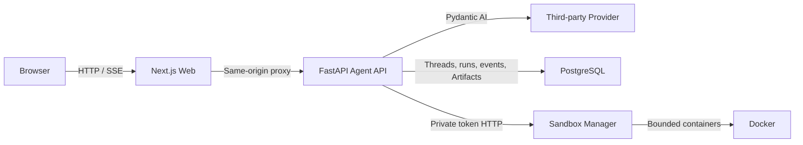

# AgentOS

[English](README.md) | [简体中文](README.zh-CN.md)

AgentOS is a work-in-progress runtime platform for building controllable, durable AI agents. It combines a Next.js interface, a FastAPI and Pydantic AI runtime, third-party model Providers, and PostgreSQL-backed conversation state.

The project is being built in public from a small, verifiable core toward tool execution, human approval, isolated sandboxes, and multi-tenant operation.

> [!WARNING]
> AgentOS is under active development and is not production-ready. Invite-only authentication, per-user Thread isolation, the core Human-in-the-Loop (HITL) approval flow, optional read-only MCP support, and an opt-in Docker Sandbox MVP are implemented; organization tenancy and production Sandbox operations are not complete.

## Available Today

- A custom Next.js chat interface with streaming output, cancellation, and runtime health status.
- A FastAPI Agent API powered by Pydantic AI and third-party model Providers.
- Server-Sent Events (SSE) for incremental text, completion, and safe error events.
- Durable PostgreSQL storage for threads, messages, runs, model histories, and append-only run events.
- Conversation recovery from a URL-backed thread ID after a page refresh.
- Bounded model context restored from recent completed runs.
- One active run per thread, with completed, failed, and cancelled terminal states.
- Model token usage and request count recorded for completed runs.
- Invite-only authentication with revocable HttpOnly sessions and per-user Thread, Run, and history isolation.
- Admin invitation-link management, plus a controlled CLI for creating the first invitation.
- Read-only `web_search` with Tavily-first and DuckDuckGo fallback routing.
- Read-only `fetch_url` with Firecrawl/local fallback, SSRF checks, truncation, and outlines.
- Tool Registry with `allow`, `ask`, and `deny` policy decisions.
- Multi-Agent selection, generic Case records, and Case-scoped Run, Artifact, and memory boundaries.
- Basic Case membership roles (`owner`, `editor`, `viewer`) with same-origin member management for existing active users.
- Curated MMA/PA `knowledge_search`, growth assessment, and an optional read-only PubMed MCP toolset (disabled by default).
- An opt-in user-level Docker Sandbox Manager with per-user workspaces, bounded network-disabled execution, and owner-scoped output Artifacts.
- Ops controls for per-Agent built-in tool policies: inherit, allow, ask, or deny.
- Persistent HITL interrupts with approval, denial, idempotent resume, cancellation, and timeout auto-denial.
- Tool-call timeline cards, approval cards, thread rename/delete, and automatic thread titles.
- Typed backend checks with pytest, Ruff, and Pyright, plus ESLint and Prettier for the web app.

## Architecture



Browser traffic stays on the Next.js origin. Route Handlers proxy health, chat streams, and thread history to the Agent API, while the Agent API owns model execution and durable state.

## Tech Stack

| Layer       | Technology                                        |
| ----------- | ------------------------------------------------- |
| Web         | Next.js 16, React 19, TypeScript, Tailwind CSS 4  |
| Agent API   | Python 3.13, FastAPI, Pydantic AI                 |
| Model       | Third-party OpenAI-compatible Providers            |
| Persistence | PostgreSQL 17, SQLAlchemy async, asyncpg, Alembic |
| Tooling     | pnpm, uv, pytest, Ruff, Pyright, ESLint, Prettier |

## Quick Start

### Prerequisites

- Node.js `>=22.16.0` (22 LTS recommended; 24 is supported)
- pnpm `11.2.2`
- Python `3.13` and [uv](https://docs.astral.sh/uv/)
- Docker with Docker Compose
- A third-party OpenAI-compatible model endpoint

All commands below run from the repository root.

### 1. Install dependencies

```bash
pnpm install
uv sync --directory services/agent-api
uv sync --directory services/sandbox-manager
```

### 2. Configure the environment

```bash
cp infra/postgres/.env.example infra/postgres/.env
cp services/agent-api/.env.example services/agent-api/.env
cp apps/web/.env.example apps/web/.env.local
```

Set the same local database password in `infra/postgres/.env` and `services/agent-api/.env`. Configure `BACKGROUND_*` with the endpoint used for background extraction and embeddings, then create a chat Provider in Ops and publish each Agent with that Provider selected.

### 3. Start PostgreSQL and migrate the schema

```bash
docker compose --env-file infra/postgres/.env -f infra/postgres/compose.yaml up -d
uv run --directory services/agent-api alembic upgrade head
```

### 4. Start the Agent API

```bash
uv run --directory services/agent-api fastapi dev src/agent_api/main.py --port 8000
```

The health endpoint is available at `http://127.0.0.1:8000/health`, and interactive API documentation is available at `http://127.0.0.1:8000/docs`.

### 4a. Optional: start the Sandbox Manager

Copy `services/sandbox-manager/.env.example` to `.env`, set a random
`SANDBOX_MANAGER_TOKEN`, and use the same token plus `SANDBOX_ENABLED=true` in the
Agent API `.env`. Then run:

```bash
uv run --directory services/sandbox-manager uvicorn sandbox_manager.main:app --host 127.0.0.1 --port 8788
```

### 5. Start the web app

In another terminal:

```bash
pnpm dev:web
```

Open `http://127.0.0.1:3000`.

### 6. Create the first administrator invitation

Set `AUTH_ADMIN_EMAILS` to the first administrator email in `services/agent-api/.env`, and set `WEB_APP_ORIGIN` to the actual Web origin. Then run the controlled development CLI:

```bash
uv run --directory services/agent-api python scripts/create_invitation.py admin@example.com
```

Open the generated link to complete the first registration. See [authentication](docs/11-authentication.md) for the full identity boundary.

## Verification

Run the repository checks before opening a pull request:

```bash
uv run --directory services/agent-api pytest
uv run --directory services/agent-api ruff check .
uv run --directory services/agent-api ruff format --check .
uv run --directory services/agent-api pyright
pnpm lint:web
pnpm build:web
pnpm format:check
```

Backend integration tests require the development PostgreSQL instance and an up-to-date schema.

## Repository Layout

```text
AgentOS/
├── apps/web/                 Next.js user interface and same-origin API proxies
├── services/agent-api/       FastAPI, Pydantic AI, persistence, and migrations
├── services/sandbox-manager/ Private Docker execution boundary
├── packages/                Shared packages (reserved)
├── infra/postgres/          Local PostgreSQL Compose configuration
└── docs/                    Architecture, implementation, and operations notes
```

Start with the [documentation index](docs/README.md) for the architecture baseline, MVP roadmap, API behavior, persistence rules, and implementation progress.

## Roadmap

- Broader read-only MCP integration and controlled local tools.
- Sandbox terminal/WebSocket UX, production image governance, quotas, cleanup, and broader execution observability.
- Artifact persistence and audit records.
- Organization-level tenancy, invitation delivery, user disablement, and administrator audit.
- Multiple model providers, durable workflows, and observability.

See the [MVP roadmap](docs/02-mvp-roadmap.md) for phase boundaries and acceptance criteria.

## Contributing

Issues and pull requests are welcome while the project is evolving. Before contributing:

1. Read the [development workflow](docs/03-development-workflow.md).
2. Keep changes scoped and update the relevant documentation when behavior changes.
3. Run the verification commands above.
4. Do not commit `.env` files, credentials, model data, or local runtime artifacts.

## License

A license has not been selected yet. Until a `LICENSE` file is added, no open-source license is granted.
