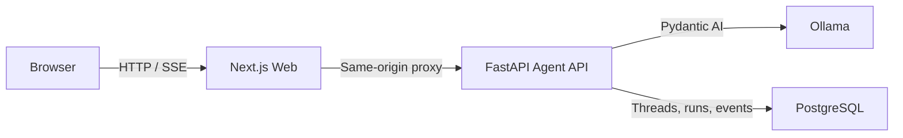

# AgentOS

[English](README.md) | [简体中文](README.zh-CN.md)

AgentOS is a work-in-progress runtime platform for building controllable, durable AI agents. It combines a Next.js interface, a FastAPI and Pydantic AI runtime, local Ollama models, and PostgreSQL-backed conversation state.

The project is being built in public from a small, verifiable core toward tool execution, human approval, isolated sandboxes, and multi-tenant operation.

> [!WARNING]
> AgentOS is under active development and is not production-ready. Authentication, tenant isolation, MCP tools, Human-in-the-Loop (HITL), and sandbox execution are not implemented yet.

## Available Today

- A custom Next.js chat interface with streaming output, cancellation, and runtime health status.
- A FastAPI Agent API powered by Pydantic AI and an Ollama model.
- Server-Sent Events (SSE) for incremental text, completion, and safe error events.
- Durable PostgreSQL storage for threads, messages, runs, model histories, and append-only run events.
- Conversation recovery from a URL-backed thread ID after a page refresh.
- Bounded model context restored from recent completed runs.
- One active run per thread, with completed, failed, and cancelled terminal states.
- Model token usage and request count recorded for completed runs.
- Typed backend checks with pytest, Ruff, and Pyright, plus ESLint and Prettier for the web app.

## Architecture



Browser traffic stays on the Next.js origin. Route Handlers proxy health, chat streams, and thread history to the Agent API, while the Agent API owns model execution and durable state.

## Tech Stack

| Layer       | Technology                                        |
| ----------- | ------------------------------------------------- |
| Web         | Next.js 16, React 19, TypeScript, Tailwind CSS 4  |
| Agent API   | Python 3.13, FastAPI, Pydantic AI                 |
| Model       | Ollama (default: `gemma4:e4b`)                    |
| Persistence | PostgreSQL 17, SQLAlchemy async, asyncpg, Alembic |
| Tooling     | pnpm, uv, pytest, Ruff, Pyright, ESLint, Prettier |

## Quick Start

### Prerequisites

- Node.js `>=22.16.0 <23`
- pnpm `11.2.2`
- Python `3.13` and [uv](https://docs.astral.sh/uv/)
- Docker with Docker Compose
- [Ollama](https://ollama.com/) and a locally available chat model

All commands below run from the repository root.

### 1. Install dependencies

```bash
pnpm install
uv sync --directory services/agent-api
```

### 2. Configure the environment

```bash
cp infra/postgres/.env.example infra/postgres/.env
cp services/agent-api/.env.example services/agent-api/.env
cp apps/web/.env.example apps/web/.env.local
```

Set the same local database password in `infra/postgres/.env` and `services/agent-api/.env`. You can also change `OLLAMA_MODEL` and `OLLAMA_BASE_URL` in the Agent API environment file.

The default model can be installed with:

```bash
ollama pull gemma4:e4b
```

### 3. Start PostgreSQL and migrate the schema

```bash
docker compose --env-file infra/postgres/.env -f infra/postgres/compose.yaml up -d
uv run --directory services/agent-api alembic upgrade head
```

### 4. Start the Agent API

```bash
uv run --directory services/agent-api fastapi dev src/agent_api/main.py --port 8000
```

The health endpoint is available at `http://127.0.0.1:8000/health`, and interactive API documentation is available at `http://127.0.0.1:8000/docs`.

### 5. Start the web app

In another terminal:

```bash
pnpm dev:web
```

Open `http://127.0.0.1:3000`.

## Verification

Run the repository checks before opening a pull request:

```bash
uv run --directory services/agent-api pytest
uv run --directory services/agent-api ruff check .
uv run --directory services/agent-api ruff format --check .
uv run --directory services/agent-api pyright
pnpm lint:web
pnpm build:web
pnpm format:check
```

Backend integration tests require the development PostgreSQL instance and an up-to-date schema.

## Repository Layout

```text
AgentOS/
├── apps/web/                 Next.js user interface and same-origin API proxies
├── services/agent-api/      FastAPI, Pydantic AI, persistence, and migrations
├── packages/                Shared packages (reserved)
├── infra/postgres/          Local PostgreSQL Compose configuration
└── docs/                    Architecture, implementation, and operations notes
```

Start with the [documentation index](docs/README.md) for the architecture baseline, MVP roadmap, API behavior, persistence rules, and implementation progress.

## Roadmap

- Tool registry and policy enforcement.
- Read-only MCP integration and controlled local tools.
- Persistent HITL interrupts, approvals, rejection, and idempotent resume.
- Per-user Docker sandboxes with resource limits, timeouts, and network isolation.
- Authentication and tenant isolation.
- Multiple model providers, durable workflows, and observability.

See the [MVP roadmap](docs/02-mvp-roadmap.md) for phase boundaries and acceptance criteria.

## Contributing

Issues and pull requests are welcome while the project is evolving. Before contributing:

1. Read the [development workflow](docs/03-development-workflow.md).
2. Keep changes scoped and update the relevant documentation when behavior changes.
3. Run the verification commands above.
4. Do not commit `.env` files, credentials, model data, or local runtime artifacts.

## License

A license has not been selected yet. Until a `LICENSE` file is added, no open-source license is granted.
