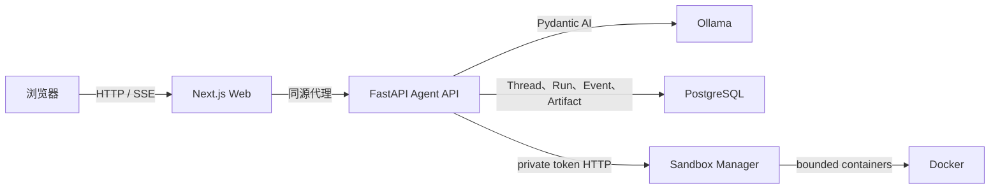

# AgentOS

[English](README.md) | [简体中文](README.zh-CN.md)

AgentOS 是一个正在开发中的可控、可持久化 AI Agent Runtime 平台。项目组合了 Next.js 界面、FastAPI 与 Pydantic AI Runtime、本地 Ollama 模型，以及由 PostgreSQL 持久化的会话状态。

项目从一个小而可验证的核心开始公开构建，逐步扩展到工具执行、人工审批、隔离 Sandbox 和多租户运行。

> [!WARNING]
> AgentOS 仍在积极开发中，尚未达到生产可用状态。invite-only 认证、用户级 Thread 隔离、Human-in-the-Loop (HITL) 核心流程、可选只读 MCP 和 opt-in 用户级 Docker Sandbox MVP 已实现；组织级租户和生产级 Sandbox 运维仍未完成。

## 当前能力

- 自定义 Next.js 聊天界面，支持流式输出、停止生成和 Runtime 健康状态。
- 基于 FastAPI、Pydantic AI 和 Ollama 模型的 Agent API。
- 使用 Server-Sent Events (SSE) 传输文本增量、完成事件和安全错误事件。
- 使用 PostgreSQL 持久化 Thread、Message、Run、模型历史和只追加的 Run Event。
- 通过写入 URL 的 Thread ID，在页面刷新后恢复会话。
- 从最近完成的 Run 中恢复有界模型上下文。
- 每个 Thread 同时只允许一个活动 Run，并持久化 completed、failed 和 cancelled 终态。
- 记录已完成 Run 的模型 token 用量和请求次数。
- invite-only 身份认证、可撤销 HttpOnly session，以及用户级 Thread、Run 与历史隔离。
- 管理员在页面生成邀请链接；首次管理员可通过受控 CLI 生成链接。
- 多 Agent 选择、通用 Case 档案，以及 Run、Artifact 和用户记忆的 Case 作用域隔离。
- 基础 Case 成员角色（`owner`、`editor`、`viewer`）和同源成员管理；成员必须是已有 active 用户。
- 策展版 MMA/PA `knowledge_search`、生长评估，以及默认关闭的只读 PubMed MCP 工具集。
- 可选的用户级 Docker Sandbox Manager：按用户持久化工作区，容器默认禁网并限制资源，输出可归档为 Artifact。
- Ops 可按 Agent 逐项配置内置工具策略：继承平台默认、允许、每次审批或禁止。
- 后端使用 pytest、Ruff 和 Pyright，前端使用 ESLint 和 Prettier 进行质量检查。

## 架构



浏览器请求始终停留在 Next.js 同源边界内。Route Handler 将健康检查、聊天流和 Thread 历史代理到 Agent API；Agent API 负责模型执行和持久化状态。

## 技术栈

| 层级      | 技术                                              |
| --------- | ------------------------------------------------- |
| Web       | Next.js 16、React 19、TypeScript、Tailwind CSS 4  |
| Agent API | Python 3.13、FastAPI、Pydantic AI                 |
| 模型      | Ollama（默认：`gemma4:e4b`）                      |
| 持久化    | PostgreSQL 17、SQLAlchemy async、asyncpg、Alembic |
| 工具链    | pnpm、uv、pytest、Ruff、Pyright、ESLint、Prettier |

## 快速开始

### 环境要求

- Node.js `>=22.16.0 <23`
- pnpm `11.2.2`
- Python `3.13` 和 [uv](https://docs.astral.sh/uv/)
- Docker 和 Docker Compose
- [Ollama](https://ollama.com/) 以及一个本地可用的对话模型

以下命令均在仓库根目录执行。

### 1. 安装依赖

```bash
pnpm install
uv sync --directory services/agent-api
uv sync --directory services/sandbox-manager
```

### 2. 配置环境变量

```bash
cp infra/postgres/.env.example infra/postgres/.env
cp services/agent-api/.env.example services/agent-api/.env
cp apps/web/.env.example apps/web/.env.local
```

请在 `infra/postgres/.env` 和 `services/agent-api/.env` 中设置相同的本地数据库密码。也可以在 Agent API 环境文件中修改 `OLLAMA_MODEL` 和 `OLLAMA_BASE_URL`。

默认模型可以通过以下命令安装：

```bash
ollama pull gemma4:e4b
```

### 3. 启动 PostgreSQL 并迁移数据库

```bash
docker compose --env-file infra/postgres/.env -f infra/postgres/compose.yaml up -d
uv run --directory services/agent-api alembic upgrade head
```

### 4. 启动 Agent API

```bash
uv run --directory services/agent-api fastapi dev src/agent_api/main.py --port 8000
```

健康检查地址为 `http://127.0.0.1:8000/health`，交互式 API 文档地址为 `http://127.0.0.1:8000/docs`。

### 4a. 可选：启动 Sandbox Manager

复制 `services/sandbox-manager/.env.example` 为 `.env`，设置随机的
`SANDBOX_MANAGER_TOKEN`；Agent API 的 `.env` 使用相同 token，并设置
`SANDBOX_ENABLED=true`。然后运行：

```bash
uv run --directory services/sandbox-manager uvicorn sandbox_manager.main:app --host 127.0.0.1 --port 8788
```

### 5. 启动 Web 应用

在另一个终端中执行：

```bash
pnpm dev:web
```

访问 `http://127.0.0.1:3000`。

### 6. 创建首个管理员

在 `services/agent-api/.env` 中设置 `AUTH_ADMIN_EMAILS` 为首个管理员邮箱，并将 `WEB_APP_ORIGIN` 设为 Web 的实际访问地址。随后在受控开发终端运行：

```bash
uv run --directory services/agent-api python scripts/create_invitation.py admin@example.com
```

打开输出的链接完成首次登录。完整认证边界见 [认证文档](docs/11-authentication.md)。

## 验证

提交 Pull Request 前运行仓库检查：

```bash
uv run --directory services/agent-api pytest
uv run --directory services/agent-api ruff check .
uv run --directory services/agent-api ruff format --check .
uv run --directory services/agent-api pyright
pnpm lint:web
pnpm build:web
pnpm format:check
```

后端集成测试要求开发用 PostgreSQL 已启动，并且数据库 Schema 已迁移到最新版本。

## 仓库结构

```text
AgentOS/
├── apps/web/                 Next.js 用户界面与同源 API 代理
├── services/agent-api/       FastAPI、Pydantic AI、持久化与数据库迁移
├── services/sandbox-manager/ 私有 Docker 执行边界
├── packages/                共享包（预留）
├── infra/postgres/          本地 PostgreSQL Compose 配置
└── docs/                    架构、实现与运维文档
```

建议从[文档索引](docs/README.md)开始了解架构基线、MVP 路线图、API 行为、持久化规则和实施进度。

## 路线图

- Tool Registry 和策略执行。
- 更完整的只读 MCP 集成和受控本地工具。
- 可持久化的 HITL 中断、批准、拒绝和幂等恢复。
- Sandbox 终端/WebSocket、生产镜像治理、配额、清理后台和更完整的执行观测。
- 邀请邮件送达、再登录和组织级租户隔离。
- 多模型 Provider、持久化工作流和可观测性。

阶段边界和验收标准见 [MVP 路线图](docs/02-mvp-roadmap.md)。

## 参与贡献

项目仍在持续演进，欢迎提交 Issue 和 Pull Request。参与贡献前请：

1. 阅读[开发协作流程](docs/03-development-workflow.md)。
2. 保持改动范围清晰，并在行为发生变化时更新相关文档。
3. 运行上面的验证命令。
4. 不要提交 `.env` 文件、凭据、模型数据或本地运行产物。

## 许可证

项目尚未选择许可证。在加入 `LICENSE` 文件前，项目并未授予任何开源许可。
